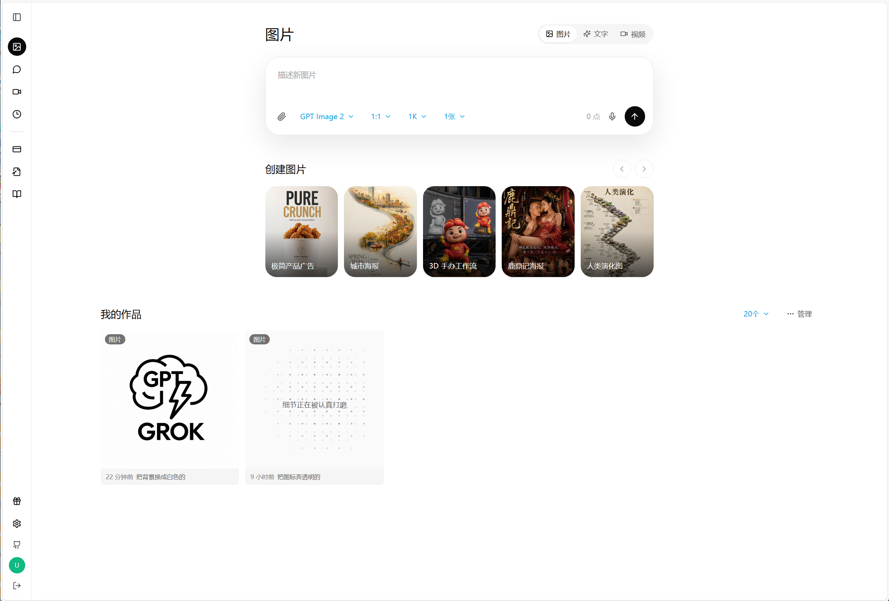
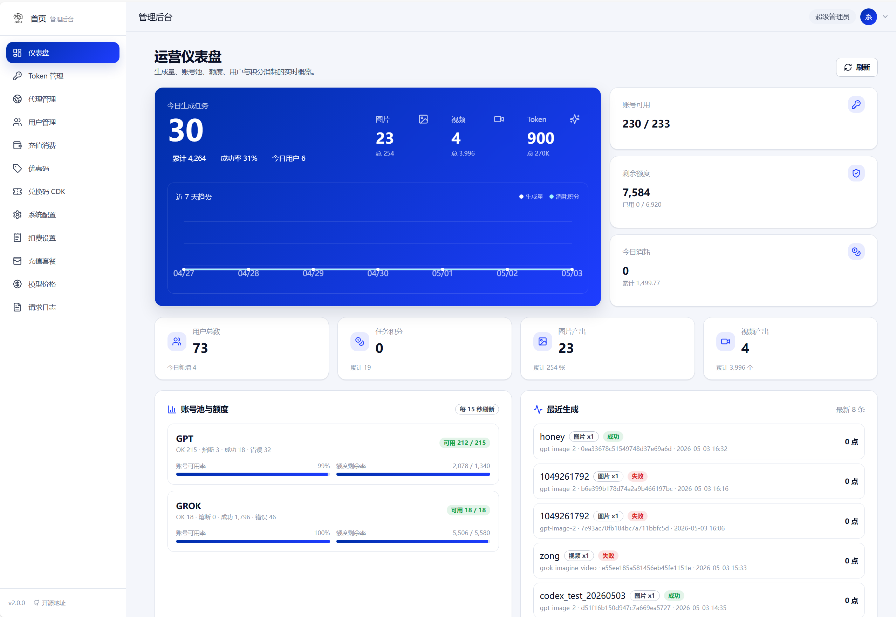

# gpt2api / KleinAI

> 一个面向 GPT / GROK 账号池的 AIGC 聚合平台，提供图片、文字、视频的一站式生成能力。  
> 前台面向创作，后台面向运营，开放 OpenAI 兼容接口，方便直接接入现有 SDK。

## 2.0 是什么

`v2.0.0` 不是简单重排界面，而是一次完整的能力升级：

- 统一文字、图片、视频三条生成链路
- 统一账号池、代理、刷新、熔断、轮换、用量检测
- 统一 OpenAI 兼容 API，前端和第三方 SDK 都能直接接
- 统一后台运营能力：用户、账单、CDK、优惠码、模型价格、请求日志、上游日志
- 统一部署方式：单机 Docker Compose 可跑，后续可平滑迁移到 K8s

## 界面预览

### 用户创作端



### 管理后台



## 核心能力

- 账号池管理：GPT / GROK 账号批量导入、刷新、检测、熔断、轮换
- 创作中心：文字对话、文生图、图生图、文生视频、图生视频
- 异步任务：图片和视频支持任务查询、历史记录、预览、下载
- OpenAI 兼容 API：
  - `GET /v1/models`
  - `POST /v1/chat/completions`
  - `POST /v1/images/generations`
  - `POST /v1/images/edits`
  - `GET /v1/images/generations/:task_id`
  - `POST /v1/video/generations`
  - `GET /v1/video/generations/:task_id`
- 管理后台：仪表盘、Token 管理、代理管理、用户管理、充值消费、优惠码、CDK、系统配置、模型价格、请求日志
- 运营能力：充值套餐、扣费规则、模型映射、自动刷新、上游日志追踪
- 部署能力：支持本地开发、单机部署、反向代理、SSL 证书自动更新

## 2.0 设计目标

1. 前台简洁统一，图片 / 文字 / 视频三个入口标准化
2. 后台更适合运营，所有配置尽量表单化，不依赖 JSON 手填
3. 账号与请求逻辑稳定，支持自动重试、换号、熔断、分批刷新
4. 上游问题可追踪，失败时能看到完整 provider 日志
5. 部署简单，能在一台 Linux 服务器上直接跑起来

## 技术栈

- 后端：Go 1.24 + Gin + GORM + MySQL + Redis
- 前端：React 18 + Vite + TypeScript + Tailwind
- 部署：Docker / Docker Compose / Nginx / Caddy
- 外部依赖：FlareSolverr、代理、对象存储（可选）

## 仓库结构

```text
.
├── backend/     # Go 后端：API / Admin / OpenAI 兼容 / Worker
├── frontend/    # 用户前台 + 管理后台
├── deploy/      # Docker Compose、Nginx、Caddy、环境变量
├── docs/        # 开发、API、部署、前端规范
└── README.md
```

## 端口说明

### 对外端口

- `17080`：用户前台
- `17088`：管理后台
- `17200`：OpenAI 兼容 API

### 本机调试端口

- `17180`：用户后端 API
- `17188`：管理后台 API
- `17200`：OpenAI 兼容 API
- `23306`：MySQL
- `16379`：Redis
- `18191`：FlareSolverr

## 快速部署

下面是推荐的线上部署方式，和当前仓库的 `deploy/docker-compose.server.yml` 对齐。

### 1. 准备环境

- 一台 Linux 服务器
- Docker 和 Docker Compose
- 1 个域名或 3 个子域名
- 80 / 443 端口可用
- MySQL / Redis 空间充足

### 2. 拉取代码

```bash
git clone https://github.com/432539/gpt2api.git
cd gpt2api
```

### 3. 配置环境

复制环境变量模板并修改：

```bash
cp deploy/env/.env.example deploy/env/.env.prod
```

重点检查这些项：

- 数据库连接
- Redis 地址
- JWT 密钥
- AES 密钥
- 域名 / CORS
- OpenAI / GROK 基础地址
- 代理与 FlareSolverr 地址

### 4. 启动服务

```bash
cd deploy
docker compose -f docker-compose.server.yml up -d --build
```

### 5. 检查状态

```bash
docker compose -f docker-compose.server.yml ps
docker logs -f klein-api-dev
docker logs -f klein-admin-dev
docker logs -f klein-openai-dev
docker logs -f klein-worker-dev
```

### 6. 访问地址

- 用户前台：`http(s)://你的域名:17080`
- 管理后台：`http(s)://你的域名:17088`
- OpenAI 兼容 API：`http(s)://你的域名:17200/v1`

## 生产建议

- 前台、后台、API 分域名部署更清晰
- 管理后台建议限制来源 IP
- OpenAI 兼容接口建议走独立域名
- 80 / 443 端口建议由 Caddy 或 Nginx 统一接管 SSL
- 图片和视频素材建议落 OSS 或本地缓存，避免直接暴露上游地址

## 开发方式

```bash
cd deploy
docker compose -f docker-compose.dev-full.yml up -d --build
```

本地开发时，前后端都可以单独启动，也可以只拉起 MySQL / Redis。

## 文档

- [开发规范](docs/01-开发规范-总览.md)
- [后端规范](docs/02-后端规范.md)
- [数据库设计](docs/03-数据库设计.md)
- [API 规范](docs/04-API规范.md)
- [前端规范](docs/05-前端规范.md)
- [部署与运维规范](docs/06-部署与运维规范.md)

## 开源地址

- [https://github.com/432539/gpt2api](https://github.com/432539/gpt2api)

## 版本与历史

- 当前默认版本：`v2.0.0`
- `v1.0.x` 保留为历史稳定版本，可通过 Git tag / 分支继续查看
- 后续发布建议采用 `v2.0.x` 继续演进，避免覆盖旧版说明

## Stars

[](https://github.com/432539/gpt2api)
